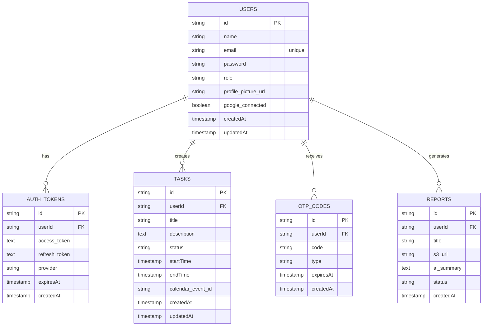

# Node.js Scalable Backend Project

A comprehensive task management API built with modern technologies and following clean architecture principles for scalability, maintainability, and performance.

## 📋 Table of Contents

- [Tech Stack](#️-tech-stack)
- [Database Schema](#️-database-schema)
- [Project Features](#-project-features)
- [Development Team](#-development-team)

## 🛠️ Tech Stack

### Backend & Runtime

### Database & ORM

### Validation & Error Handling

### DevOps & Deployment

### Code Quality

## 🗄️ Database Schema

Our application uses a comprehensive PostgreSQL schema designed for scalability and modern authentication:

### Key Features:

- **UUID Primary Keys** for better scalability and security
- **Comprehensive User Management** with role-based access control
- **OAuth Integration** support for multiple providers
- **Task Management** with calendar synchronization
- **Security Features** including OTP verification and 2FA
- **Report System** with AI-powered summaries
- **Proper Relationships** with cascade delete for data integrity

## 🚀 Project Features

### ✅ Implemented

- **Robust Error Handling** - Custom ErrorHandler class with factory methods
- **Type-Safe Validation** - Zod schemas with automatic validation
- **Enhanced AsyncHandler** - Zero-boilerplate async route handling
- **Database Schema** - Complete 5-table PostgreSQL schema with Drizzle ORM
- **Authentication Foundation** - User registration with validation
- **Logging System** - Winston logger with file rotation and console formatting
- **Code Quality** - ESLint, Prettier, Husky pre-commit hooks

### 🚧 In Development

- **JWT Authentication** - Token-based authentication system
- **OAuth Integration** - Google OAuth support
- **Task Management** - CRUD operations for tasks
- **OTP System** - Email verification and 2FA
- **Report Generation** - AI-powered report summaries
- **API Documentation** - Swagger/OpenAPI integration

### 📋 Planned Features

- **Calendar Integration** - Google Calendar sync
- **File Upload** - S3 integration for reports
- **Email Service** - Transactional email system
- **Rate Limiting** - API rate limiting and throttling
- **Caching** - Redis caching layer
- **Testing Suite** - Comprehensive unit and integration tests

## 👥 Development Team

### Made with ❤️ by:

- **Shubhojit Mitra** - System Architecture
- **Khushi Malik** - Backend Developer
- **Utkarsh Kapoor** - Backend & Database
- **Priyanshi Varshney** - API Documentation & Testing
- **Nancy Gumanta** - Testing & Quality Assurance

---

## 📝 Project Status

**Current Version**: 1.0.0 (Development)  
**Last Updated**: October 2025  
**License**: MIT License

This project is actively under development. Setup guides, API documentation, and deployment instructions will be added once core features are completed.
