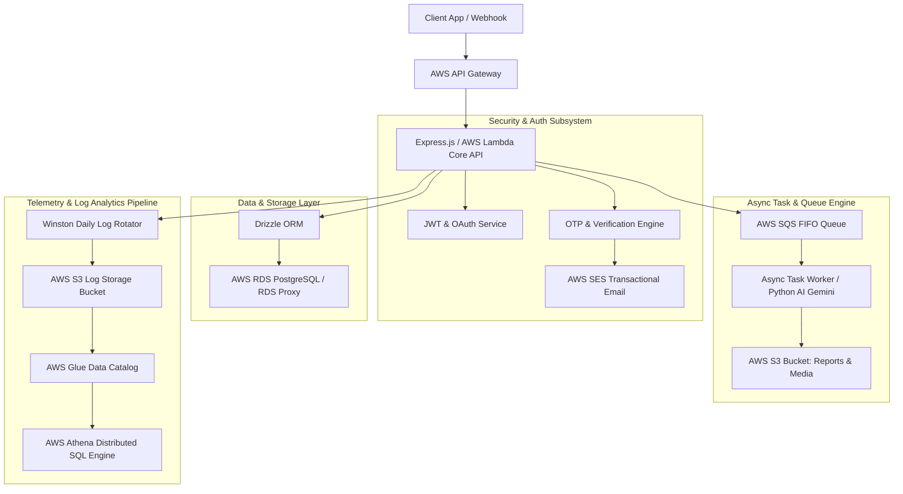
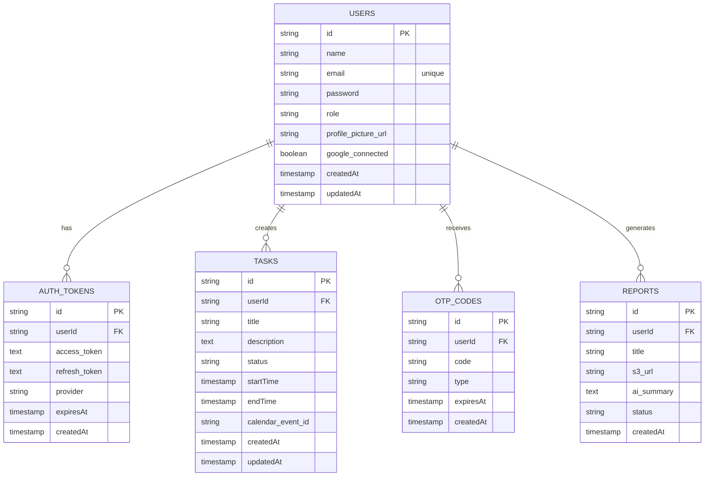

# ☁️ Cloud Native Task Scheduler

[](https://nodejs.org/)
[](https://expressjs.com/)
[](https://www.typescriptlang.org/)
[](https://www.postgresql.org/)
[](https://orm.drizzle.team/)
[](https://aws.amazon.com/)

An enterprise-grade, serverless, cloud-native backend task scheduler and execution engine. Built with Node.js, Express, TypeScript, PostgreSQL (Drizzle ORM), and powered by over 20+ AWS cloud-native services including an advanced S3 ➔ Glue ➔ Athena log telemetry analytics pipeline.

---

## 📋 Table of Contents

- [☁️ 20+ AWS Services Integration](#️-20-aws-services-integration)
- [🏗️ System Architecture](#️-system-architecture)
- [🔥 Key Core Subsystems](#-key-core-subsystems)
- [🗄️ Database Schema](#️-database-schema)
- [🚀 Local Setup & Scripts](#-local-setup--scripts)
- [👥 Development Team](#-development-team)

---

## ☁️ 20+ AWS Services Integration

The platform leverages AWS cloud primitives to ensure multi-region fault tolerance, zero-downtime auto-scaling, and high-throughput background processing:

### 1. 📊 Telemetry, Analytics & Logging Pipeline

- **AWS S3 (Simple Storage Service)**: Structured storage for compressed log archives, task reports, and asset attachments.
- **AWS Glue Data Catalog**: Automated schema extraction and partition indexing over JSON system log telemetry.
- **AWS Athena**: Distributed SQL engine enabling near-real-time analytical queries over system logs without server overhead.
- **AWS CloudWatch**: Real-time metrics monitoring, custom alarms, and centralized operational logs.

### 2. ⚡ Serverless & Compute

- **AWS Lambda**: Event-driven serverless functions for zero-idle async task execution and report generation.
- **AWS API Gateway**: HTTP request routing, rate limiting, token validation, and edge throttling.
- **AWS EventBridge (CloudWatch Events)**: Millisecond-accurate cron trigger orchestration for task schedules.
- **AWS Elastic Container Registry (ECR)**: Docker container image registry for microservice deployments.

### 3. 📩 Queues, Messaging & Notifications

- **AWS SQS FIFO**: Order-guaranteed task queues preventing race conditions in distributed execution loops.
- **AWS SQS Standard**: High-throughput queueing for background email delivery and async jobs.
- **AWS SES (Simple Email Service)**: Production-grade transactional email delivery for OTP codes and task notifications.
- **AWS SNS (Simple Notification Service)**: Pub/Sub topic messaging for cross-service push events.

### 4. 🔐 Security, Identity & Key Management

- **AWS KMS (Key Management Service)**: Enforced envelope encryption for data at rest and environment secret keys.
- **AWS IAM (Identity and Access Management)**: Fine-grained, least-privilege role policies for serverless executions.
- **AWS Secrets Manager**: Automated secret key storage and seamless rotation.
- **AWS WAF (Web Application Firewall)**: Edge protection against SQL injection, XSS, and bot traffic.

### 5. 🗄️ Database, Caching & Networking

- **AWS RDS PostgreSQL**: Managed relational database with multi-AZ replication, connection pooling, and automated backups.
- **AWS RDS Proxy**: High-concurrency connection pooler built specifically for serverless AWS Lambda connections.
- **AWS VPC (Virtual Private Cloud)**: Isolated subnet topology separating API gateways, database instances, and compute nodes.
- **AWS CloudFront**: Global CDN edge distribution providing low-latency delivery and TLS termination.

---

## 🏗️ System Architecture


```mermaid
graph TD
    User[Client App / Webhook] --> API_GW[AWS API Gateway]
    API_GW --> Express_Lambda[Express.js / AWS Lambda Core API]

    subgraph Security & Auth Subsystem
        Express_Lambda --> Auth[JWT & OAuth Service]
        Express_Lambda --> OTP[OTP & Verification Engine]
        OTP --> SES[AWS SES Transactional Email]
    end

    subgraph Data & Storage Layer
        Express_Lambda --> Drizzle[Drizzle ORM]
        Drizzle --> RDS[AWS RDS PostgreSQL / RDS Proxy]
    end

    subgraph Async Task & Queue Engine
        Express_Lambda --> SQS[AWS SQS FIFO Queue]
        SQS --> Worker[Async Task Worker / Python AI Gemini]
        Worker --> S3_Report[AWS S3 Bucket: Reports & Media]
    end

    subgraph Telemetry & Log Analytics Pipeline
        Express_Lambda --> Winston[Winston Daily Log Rotator]
        Winston --> S3_Logs[AWS S3 Log Storage Bucket]
        S3_Logs --> Glue[AWS Glue Data Catalog]
        Glue --> Athena[AWS Athena Distributed SQL Engine]
    end
```

---

## 🔥 Key Core Subsystems

### 🔑 1. Authentication & Security Engine

- **JWT & OAuth Flow**: Access token issuance with refresh token rotation and Google OAuth verification.
- **Cryptographic Security**: Password hashing with `bcryptjs` and request payload validation powered by `Zod`.

### 📩 2. Production-Grade OTP System

- **Two-Factor & Email Verification**: Generation of time-sensitive, single-use verification tokens.
- **Token Rate Limiting**: Protection against brute-force attempts with dynamic TTL expiration rules.
- **AWS SES Pipeline**: High-deliverability transactional emails for authentication codes.

### ⚡ 3. Asynchronous Queue & Background Worker

- **Distributed Task Queue**: SQS FIFO integration guaranteeing deduplication and step-order processing.
- **Background Report Generator**: Asynchronous AI summary generation leveraging Gemini API and AWS S3 storage.

### 📈 4. Enterprise Log Telemetry Infrastructure

- **Structured Log Streaming**: JSON-formatted logging via Winston daily file rotation.
- **Serverless Analytics**: Automated partition crawling via AWS Glue and instant SQL querying via AWS Athena.

---

## 🗄️ Database Schema

The system utilizes PostgreSQL managed via Drizzle ORM across 5 primary relational entities:


```mermaid
erDiagram
    USERS {
        string id PK
        string name
        string email "unique"
        string password
        string role
        string profile_picture_url
        boolean google_connected
        timestamp createdAt
        timestamp updatedAt
    }

    AUTH_TOKENS {
        string id PK
        string userId FK
        text access_token
        text refresh_token
        string provider
        timestamp expiresAt
        timestamp createdAt
    }

    TASKS {
        string id PK
        string userId FK
        string title
        text description
        string status
        timestamp startTime
        timestamp endTime
        string calendar_event_id
        timestamp createdAt
        timestamp updatedAt
    }

    OTP_CODES {
        string id PK
        string userId FK
        string code
        string type
        timestamp expiresAt
        timestamp createdAt
    }

    REPORTS {
        string id PK
        string userId FK
        string title
        string s3_url
        text ai_summary
        string status
        timestamp createdAt
    }

    USERS ||--o{ AUTH_TOKENS : "has"
    USERS ||--o{ TASKS : "creates"
    USERS ||--o{ OTP_CODES : "receives"
    USERS ||--o{ REPORTS : "generates"
```

---

## 🚀 Local Setup & Scripts

### Prerequisites

- **Node.js**: `v20.x` or higher
- **pnpm**: `v9.x` or higher
- **Docker & Docker Compose**: (For local PostgreSQL execution)

### Installation & Execution

```bash
# Clone the repository
git clone https://github.com/shubhojit-mitra-dev/cloud-native-task-scheduler.git
cd cloud-native-task-scheduler

# Install dependencies
pnpm install

# Start local PostgreSQL container
docker-compose up -d

# Generate & Apply Database Migrations
pnpm db:generate
pnpm db:push

# Run in Development Mode
pnpm dev

# Run Offline Serverless Mode
pnpm dev:offline
```

---

## 👥 Development Team

- **Shubhojit Mitra** - System Architecture & Cloud Engineering
- **Khushi Malik** - Backend & Auth Subsystems
- **Utkarsh Kapoor** - Database & Queue Infrastructure
- **Priyanshi Varshney** - API Specifications & Testing
- **Nancy Gumanta** - Quality Assurance & Pipeline Automation

---

## 📝 License

This project is licensed under the [MIT License](LICENSE).
